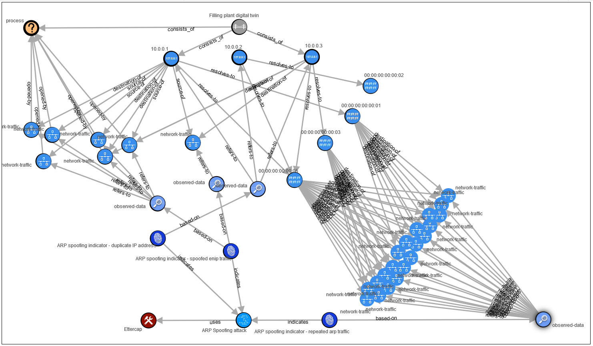
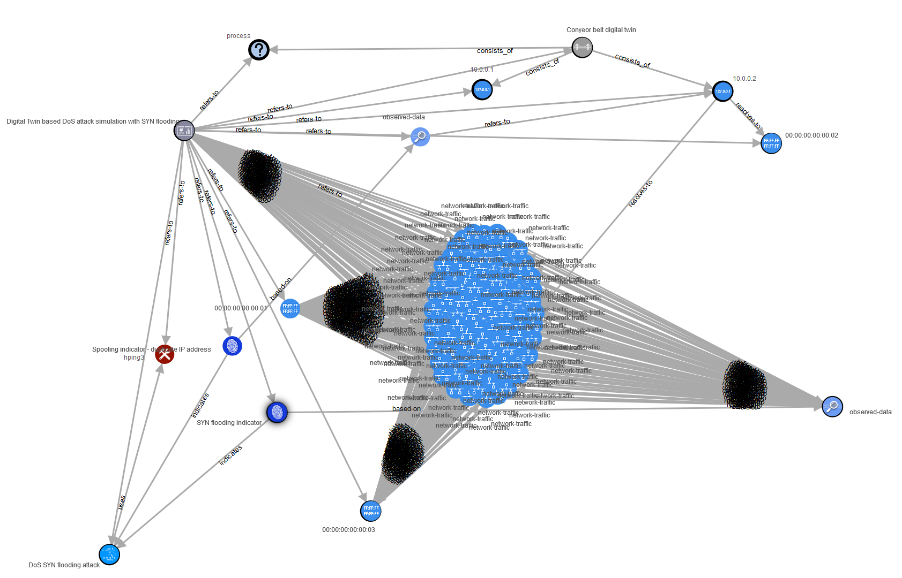

# Utilities for Cyber Threat Intelligence generation with Digital Twin data

This repository contains utilities to assist with the generation of STIX2.1 Cyber Threat Intelligence (CTI) reports based on Digital Twin simulation data.

The input data is taken from two simulation use cases (Man-in-the-Middle and Denial of Service) conducted with a prototypical Digital Twin.

In addition, existing relationships between individual STIX2.1 objects have been extracted from the [STIX2.1 specification](https://docs.oasis-open.org/cti/stix/v2.1/stix-v2.1.html).

After pre-processing the simulation data can be used to iteratively generate STIX2.1 Cyber-Observable Objects (SCO), STIX2.1 Domain Objects (SDO) and STIX2.1 Relationship Objects (SRO).

It is the aim of this prototypical implementation of CTI-DT utilities to demonstrate the feasibility of a proposed process-based framework to generate CTI reports on the basis of Digital Twin simulation output.

## Results

Using main.py allows to generate JSON reports for the MITM and DoS use case. Their visualization is displayed below.

<ins>MITM CTI Report Visualization</ins>

<ins>DoS CTI Report Visualization</ins>

## Research and Citation

Please consider citing this GitHub repository if you are using our Digital Twin CTI generation utilities.
